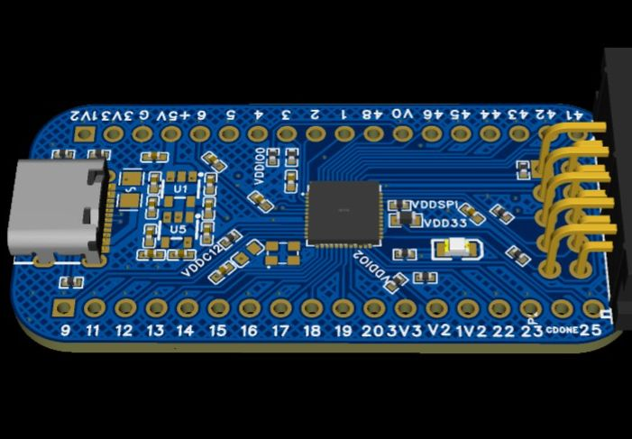

# AG1280_Core_board

AG1280采用QFN-48 6x6轻薄封装，成本超低且功率超低。该器件具有1280个LUT和最多40个用户IO，提供68Kbits嵌入式块RAM和10Kbits分布式RAM，每个器件一个PLL提供时钟倍频和相移，并通过JTAG接口进行嵌入式FLASH配置，片上时钟发生器具有宽输出频率范围。

该器件是即时启动、非易失性、多重可编程架构。该器件提供模拟LVDS输出(LVDS_E_3R)。

AG1280 的售价极具竞争力。

